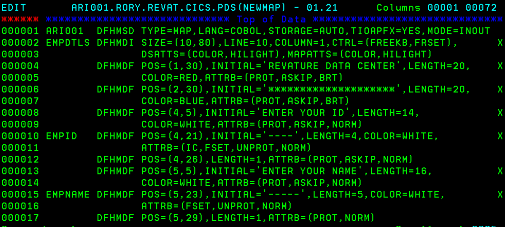
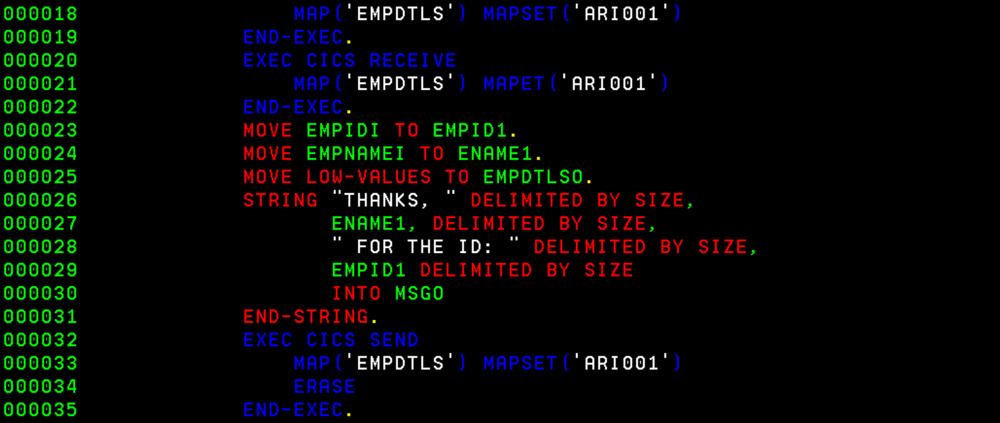

## CICS
### SEND COMMAND:
- 
### SEND AND RECEIVE:
- 
- 

### MAPS
- 
- 
- 

### COBOL MAPS PROGRAM
- 
- 
- 

### FULL MAP EXAMPLE
1. FIRST, DESIGN THE MAP USING MACROS

2. THEN, COMPILE THE MAP. NOTE THE JOBNAME, COPYLIB, AND WE PASS IN THE LOCATION OF THE MAP DESIGN FILE TO SYSUT1

3. WRITE A COBOL PROGRAM

4. COMPILE THE COBOL PROGRAM. NOTE THE JOBNAME, COPYLIB, TRN.SYSIN, AND LKED.SYSIN

5. LOG IN TO CICS

6. ENTER THE FOLLOWING COMMAND

7. VERIFY THE RELEVANT THINGS ARE NORMAL

8. CLEAR THE TERMINAL. IF YOU DON'T SEE THE TOOLBAR, CAN GO TO TOOLS -> TOOLBARS

9. FINALLY, ENTER YOUR TRANSACTION ID AND YOU SHOULD SEE THE MAP:
