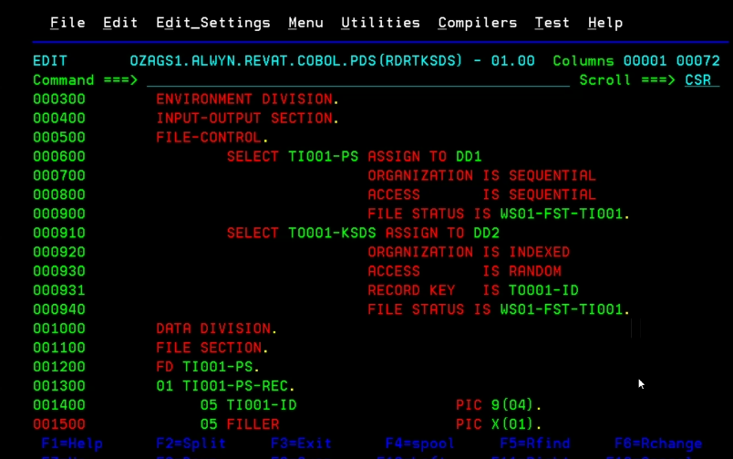
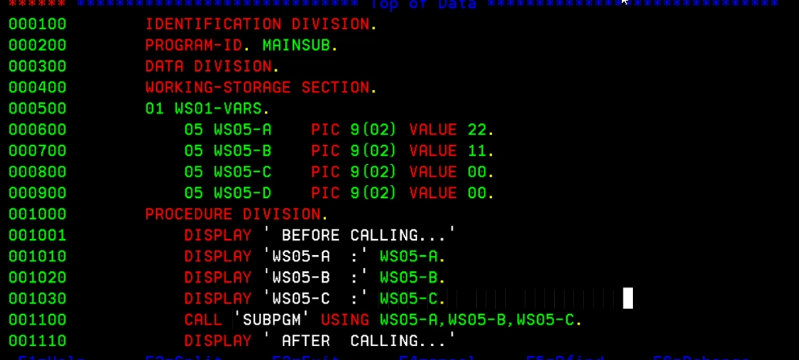

## COBOL
### COMPJCL
- 
### RUNJCL
- 
### FIRST PROGRAM
- 

### DATA DIVISION
- 
#### With stars:
- 

### SIGNED DATA:
- 

### DECIMAL DATA:
- 

### LEVEL NUMBERS:
- 
#### ANOTHER EXAMPLE OF LEVEL NUMBERS:
- 
- 

### ARITHMETIC:
- 
- 

### IF AND EVALUATE STATEMENTS:
- 

### PARAGRAPHS
- 

### PERFORM
#### UNCONDITIONAL OUT OF THE LINE PERFORM
- 

### STANDARDS
#### FOLLOWING IS THE STANDARD FOR WRITING COBOL PROGRAMS:
- 
#### PERFORM EXAMPLE:
- 
- 
- 

### MOVE
#### CORRESPONDING MOVE AND LENGTH EXAMPLE:
- 
- 

### READING AND VERIFYING FILES
- 
- 
- 
- 
- 
- 

### READING AND WRITING TO/FROM A PS:
- 
- 
- 
- 
- 
- 
- 
- 
- 

### READING FROM A PS AND WRITING TO A KSDS
- 

### SUBPROGRAMS
#### INSTREAM SUBPROGRAM:
- 
- 
- 

#### CATALOGUED SUBPROGRAM
##### MAIN PROGRAM
- 
- 
##### SUBPROGRAM
- 
##### COMPILE SUBPROGRAM
- 
##### COMPILE MAINPROGRAM
- *Note: Line 012 should be uncommented:*
- 
##### BY REFERENCE VS BY CONTENT
- 
