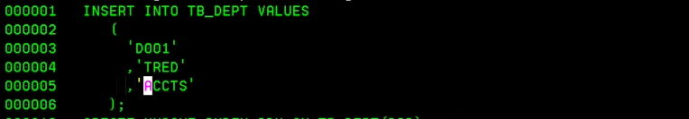
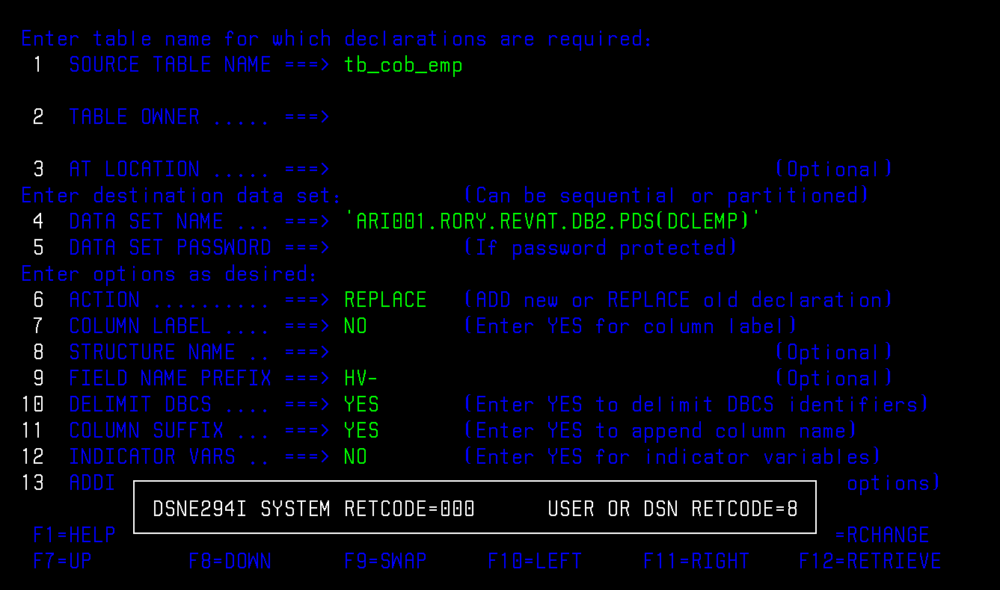

### SQL
#### CREATE
- 
##### CREATE WITH REFERENCES CLAUSE, FOREIGN KEY, REFERENTIAL INTEGRITY
- 
##### CREATE WITH PK AND FK CONSTRAINTS:
- 
#### CREATE INDEX
- 
#### INSERT
- 
##### INSERT WITH FOREIGN KEY, REFERENTIAL INTEGRITY
- 
#### INSERT NULL VALUES
- 

#### SELECT
##### SELECT WHERE ENAME IS NULL
- 

### EMBDEDDED SQL:
#### BINDRUN (WHAT IS CHANGED, ORIGINAL CAN BE FOUND IN OZAGS1.ALWYN.REVAT.DB2) RENAMED TO DB2COMP

#### PRECLINK (WHAT IS CHANGED, ORIGINAL CAN BE FOUND IN OZAGS1.ALWYN.REVAT.DB2) RENAMED TO DB2RUN

#### CREATING A DATABASE USING EMBEDDED SQL
- 
- 
- 

#### DCLGEN
##### CREATION SCREEN:
- 
##### RESULTS:
- 

#### INSERT A RECORD USING EMBEDDED SQL
- 
- 
- 

#### INSERTING WITH NULL VALUES
- 
- 

#### SELECT WITH NULL VALUES
- 
- 
- 
- 