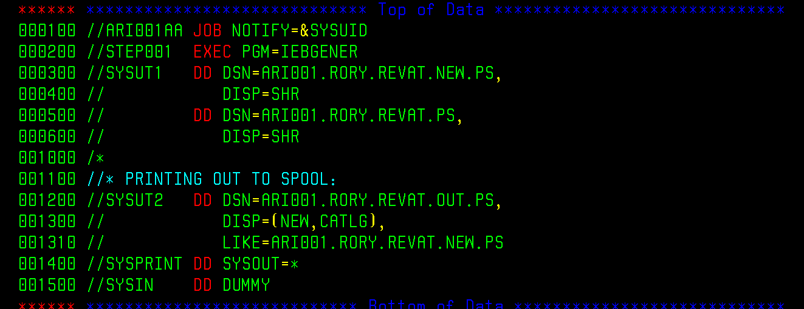

## IEBGENER
### A SIMPLE IEBGENER JOB:
- 
### IEBGENER WITH PREDELETE:
- 

## IEBCOPY
### SIMPLE COPY:
- 
### COPY WITH CONTROL CARD:
- 

## PROCEDURES
### INSTREAM PROCEDURE
- 
### CATALOGUED PROCEDURE (CATPROC)
- 
### JOB THAT CALLS PROCEDURE
- 

## SORT
### SORT FIELDS
- 
### SORT FIELDS AND SUM FIELDS
- 
### SORT FIELDS AND INCLUDE COND
- 
### SORT FIELDS AND OMIT COND
- 
### SORT FIELDS AND OUTREC FIELDS
- 
### SORT FIELDS AND OUTREC OVERLAY
- 
### SORT FIELDSAND OUTREC OVERLAY
- 
### SORT FIELDS AND OUTREC FIELDS
- 
### SORT FIELDS AND OUTREC FIELDS
- 
### SORT FIELDS AND OUTREC FIELDS AND SEQNUM
- 
### SORT FIELDS AND OUTREC FIELDS AND ARITHMETIC/ADDING
- 
### SORT FIELDS AND OUTREC FIELDS AND ARITHMETIC/ADDING
- 

## MISC
### CHECK IF FILE IS EMPTY
- 
- 

### SET COMMAND
- 

## HOW TO CHECK THE SPOOL:
### FOLLOW THESE COMMANDS:
- 
- 
- 
- 
- 
### PURGE:
- 