## ESDS
### ESDS CREATE
- 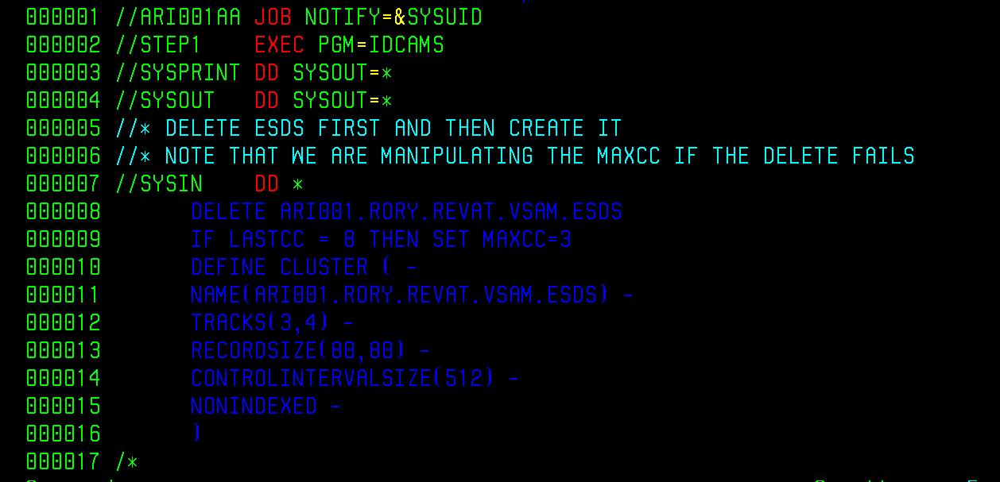
### ESDS REPRO
#### INDATASET OUTDATASET
- 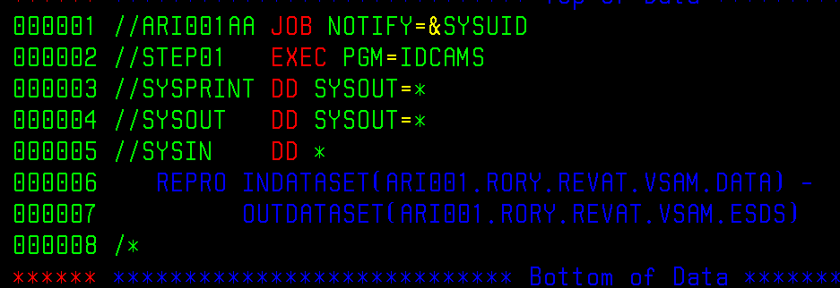
#### INFILE OUTFILE
- 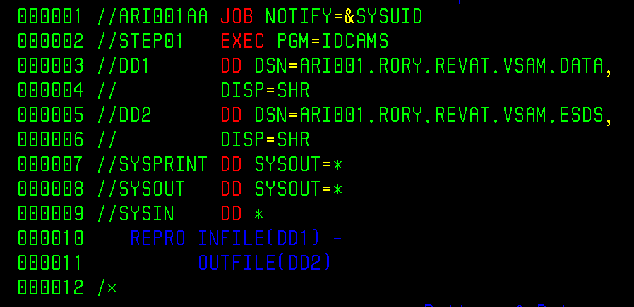
### ESDS PRINT
- 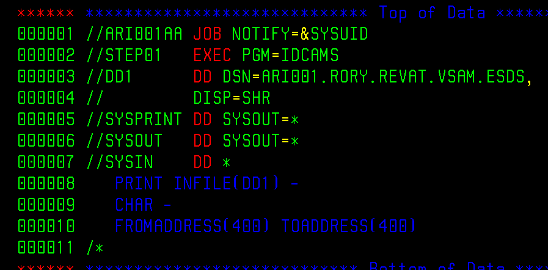
- 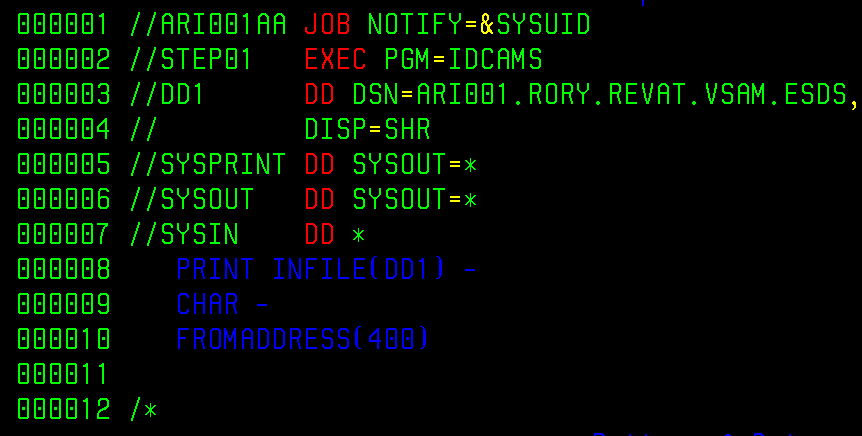
- 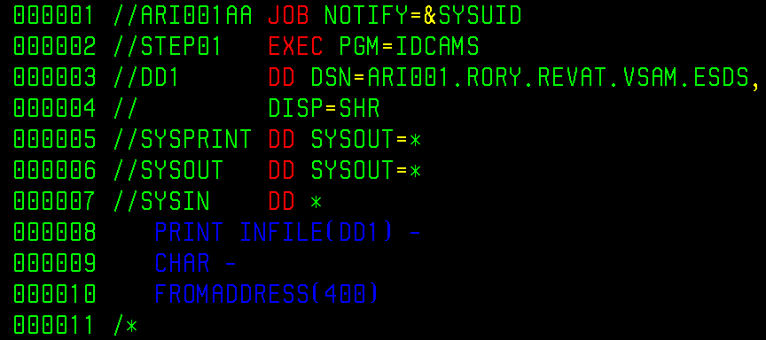
- 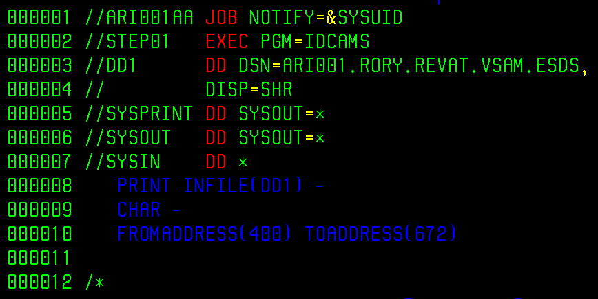

## KSDS
### KSDS CREATE
- 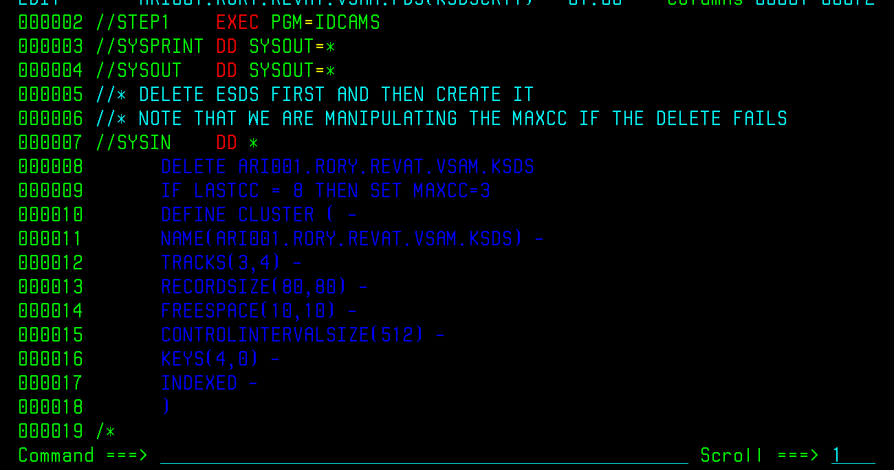
### KSDS REPRO
- 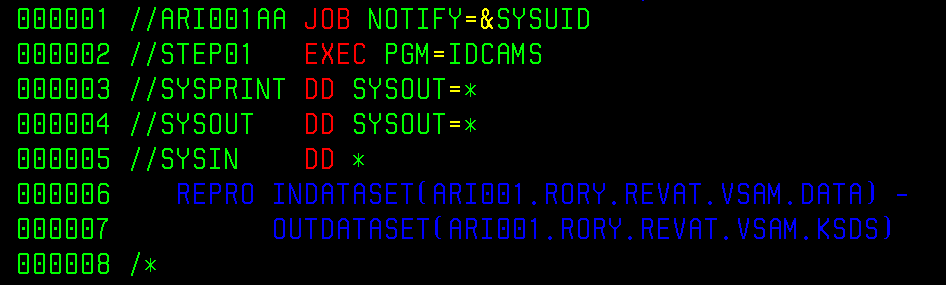
### KSDS PRINT
- 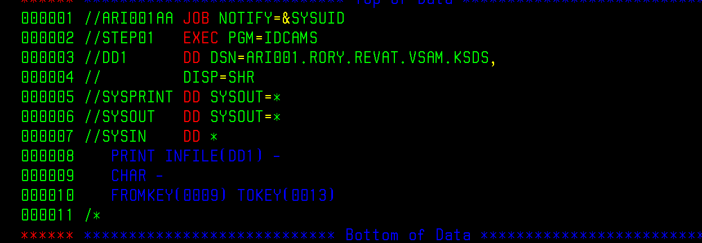

## RRDS
### RRDS CREATE
- 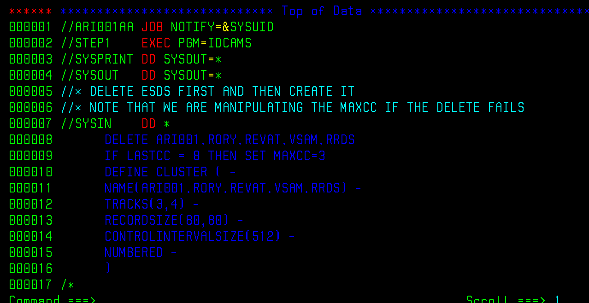
### RRDS REPRO
- 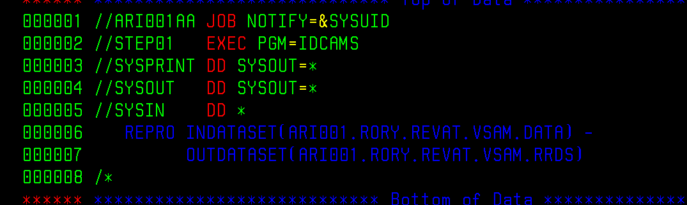
- 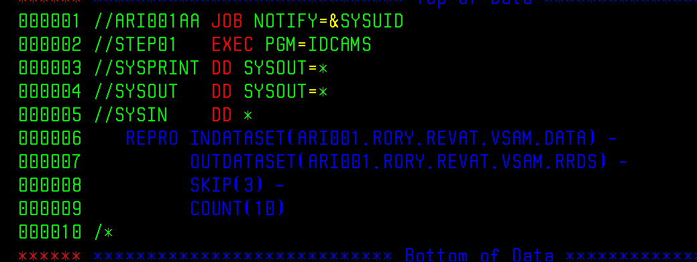
### RRDS PRINT
- 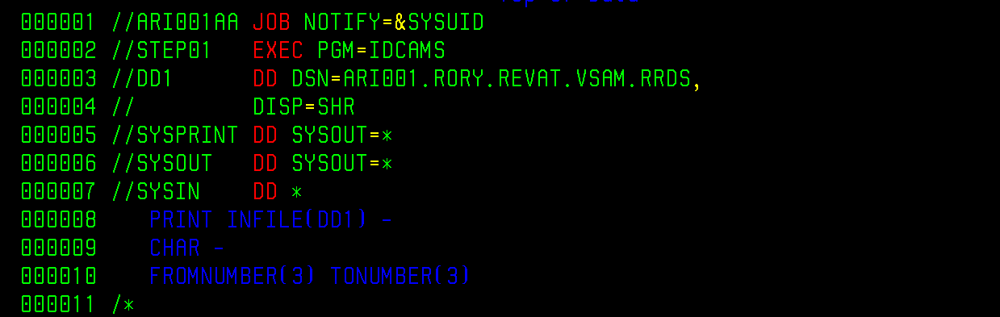

## LDS
### LDS CREATE
- 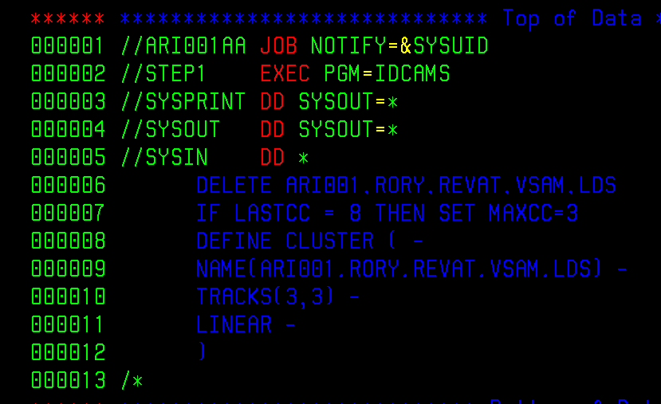

## COMMANDS
### ALTER
- 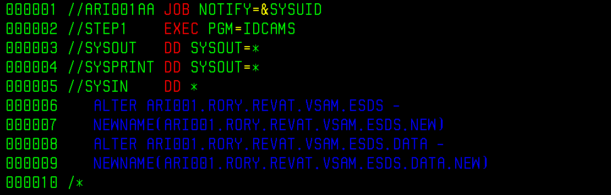
### IMPORT
- 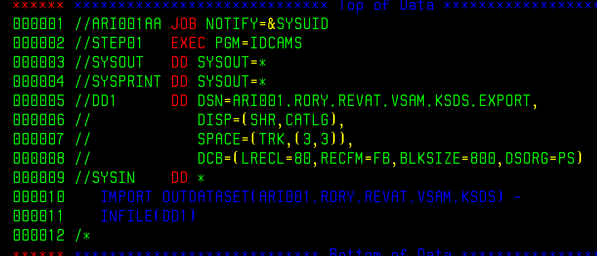
### EXPORT
- 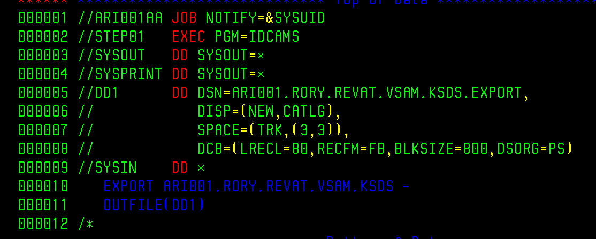
### VERIFY
- 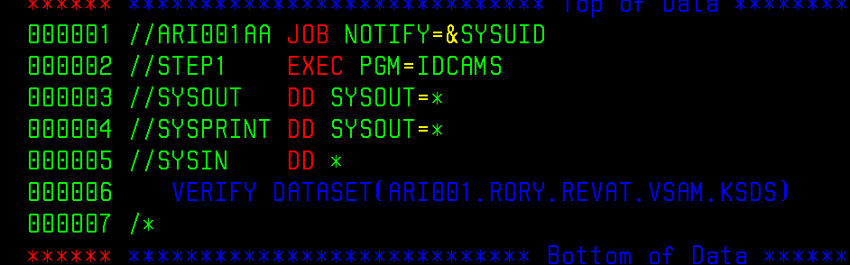

## AIX
### DEFINE AIX
- 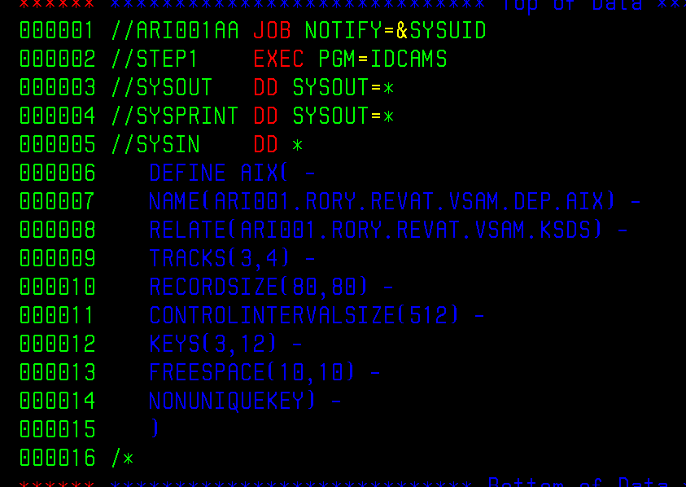
### BUILD
- 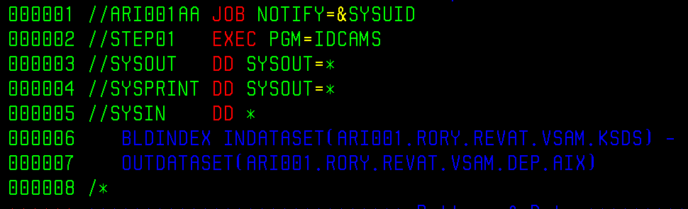
### PATH
- 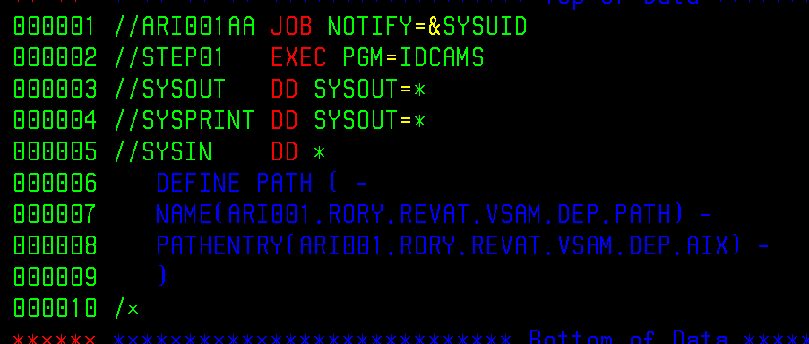