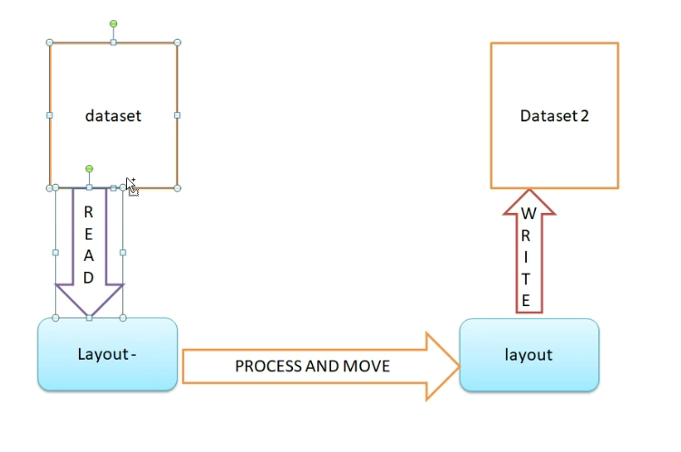

## Reading/Processing Data Sets
- 3 points we need to consider when processing data sets:
    - Link the file with the program
    - Need file layout
    - Open file in appropriate mode
    - Read/write/re-write/etc.
    - Close the File
    - File Operation Status
- File status code 10?
    - End of File
- Check if file is empty:
    - Read records and keep count by defining a counter
    - Add 1 to counter whenever the read is successful
    - When file status code is 10 (EOF), check number of records
    - If record count is 0, file is empty
- Imagine we want to check what country and then apply a salary increase for certain locations
    - We want to display old salary and the new salary
    - Where in the code should we put this check?
        - Only if records are valid, will do the calculation
    - Business Requirement:
        - If the location is in Asia -> 15% increase of salary
        - If location is in U.S. -> 20% increase of salary
        - If location is anywhere else -> 30% increase of salary
    - 3210-VALID-PARA
        - EVALUATE TRUE
        - WHEN TI001-ID      IS NUMERIC AND
            - TI001-SAL(1:5) IS NUMERIC
            - TI001-SAL(6:1) = '.' AND
            - TI001-SAL(7:2) IS NUMERIC
                - PERFORM 3211-CAL-PARA
        - WHEN OTHER
            - DISPLAY 'INVALID RECORD'
            - DISPLAY 'THE ID: ' TI001-ID
    - 3211-CAL-PARA
        - DISPLAY 'THE ID: ' TI001-ID
        - DISPLAY 'THE NAME: ' TI001-NAME
        - DISPLAY 'THE LOCATION: ' TI001-LOC
        - DISPLAY 'THE OLD SALARY: ' TI001-SAL
        - MOVE TI001-SAL to WS05-SAL
        - IF (TI001-LOC = 'CHENNAI' OR TI001-LOC = 'CHINA')
            - COMPUTE WS05-SAL * 1.15
        - ELSE IF (TI001-LOC = 'DETROIT' OR TI001-LOC = 'MICHIGAN')
            - COMPUTE WS05-SAL * 1.20
        - ELSE 
            - COMPUTE WS05-SAL = WS05-SAL*1.30
        - END-IF
        - END-IF
        - MOVE WS05-SAL TO TI001-SAL
        - DISPLAY 'THE NEW SALARY: ' TI001-SAL
    - 3211-CAL-PARA-EXIT
        - EXIT
        - .

- VALIDATIONS CONDITIONS
- New Field Logic is given
    - If location is in Asia -> 15%
    - If location is in US -> 20%
    - Otherwise -> 30%
- Data Flow
    - Open-Para
    - Read-Para until EOF
    - Close-Para
    - Read-Para -> valid-para -> calc-para -> display
- Thought Process
    - How do I link? Organization, Access?
    - What is the layout? Physical Decimal Point, any requirement that expects me to perform arithmetic operation on that variable?
    - What mode do I open? Input
    - Read until EOF?
        - Move spaces to the layout
        - Read filename
        - Check file status code variable
            - If file status is 00
                - Add 1 to record counter
                - Perform - valid-para
            - Else if file status = 10
                - Check if file is empty
            - Else
                - Read Failed
    - Close
    - Valid - failed -> display invalid
        - passes -> calculation -> display the record
        - Remember the virtual decimal point vs physical decimal point

- Read records from PS
- Validate the records
    - Calculate the new salary
    - Write the valid records into another PS
1. Link
    - Environment Division
    - Input-Output Section
    - File-Control
        - SELECT TO001-PS ASSIGN TO DDNAME
            - ORGANIZATION IS SEQUENTIAL
            - ACCESS IS SEQUENTIAL
            - FILE STATUS IS WS05-FST-TO001.
2. 
    - FD TO001-PS.
        - 01 TO001-PS-REC.
            - 05 TO001-ID       PIC 9(04).
            - 05 FILLER         PIC X(01).
            - 05 TO001-NAME     PIC A(05).
            - 05 FILLER         PIC X(01).
            - 05 TO001-LOC      PIC A(09).
            - 05 FILLER         PIC X(01).
            - 05 TO001-SAL      PIC 9(05).9(02).
            - 05 FILLER         PIC X(01).
            - 05 TO001-NEW-SAL  PIC 9(05).9(02).
            - 05 FILLER         PIC X(41).
3. OPEN
    - OPEN INPUT TI001-PS
        - ...
    - OPEN OUTPUT TO001-PS
            - IF(WS05-FST-TO001 = 0) THEN
                - DISPLAY 'TO001 OPEN SUCCESS'
            - ELSE
                - DISPLAY 'TO001 OPEN FAILED: ' WS05-FST-TO001'.
                - PERFORM 9000-TERM-PARA.
            - END-IF
4. READ -> VALID -> VAL -> WRITE
    - WRITE -> PLACE THE VALUES IN THE OUTPUT LAYOUT THAT YOU ARE PLANNING TO WRITE (MOVE STATEMENTS)
        - WRITE TI0001-PS-REC.
    - EVERY FILE CAN ONLY HANDLE ITS LAYOUT
    - FLOW:
        - DATASET-READ-LAYOUT-PROCESS-AND-MOVE-TO-OUTPUT-LAYOUT-WRITE-DATASET
