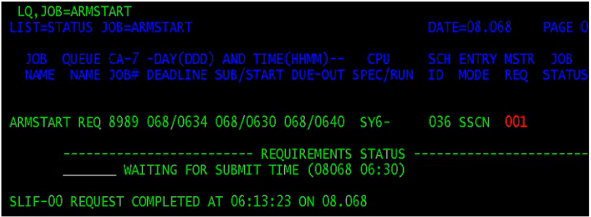
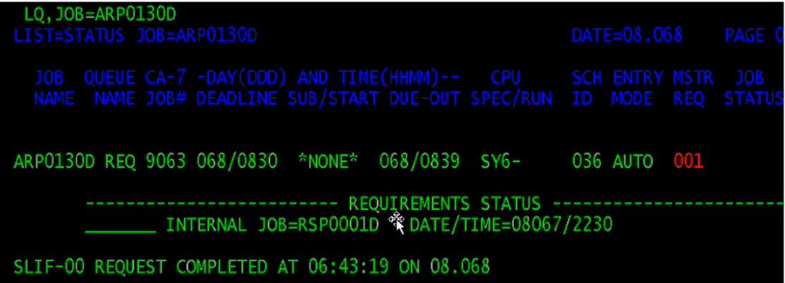
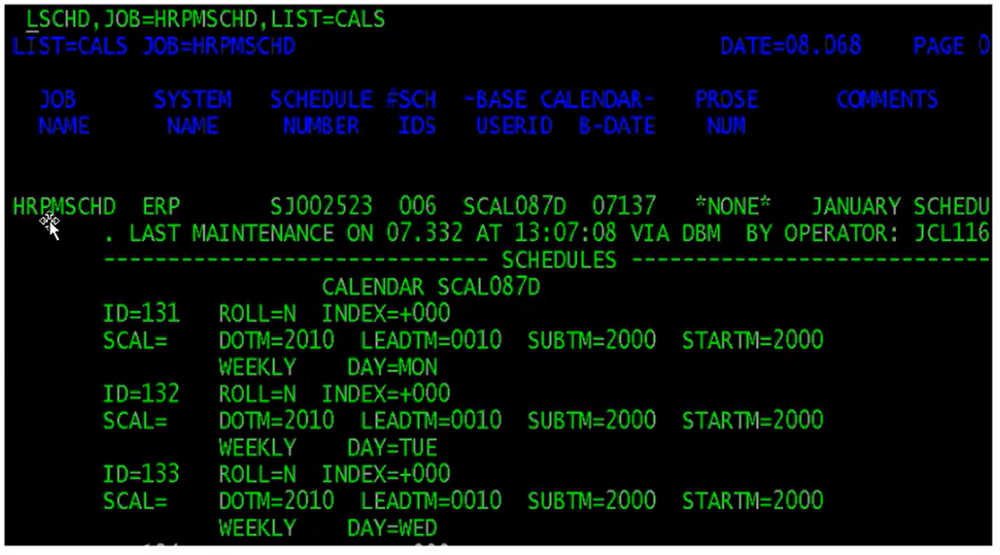
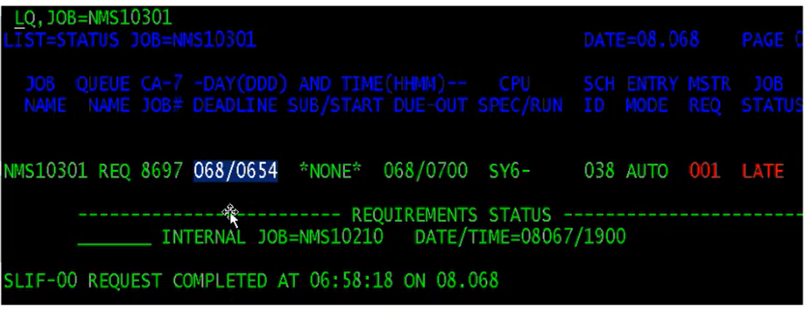
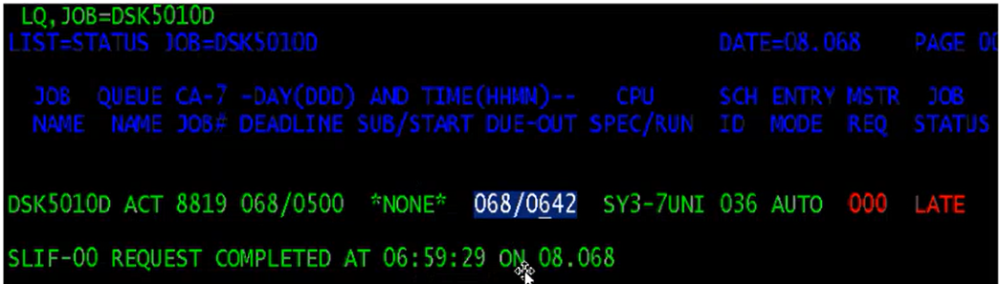
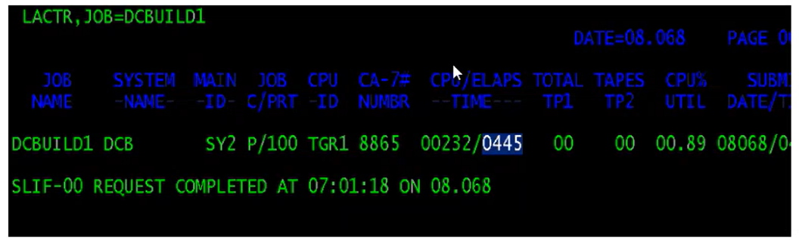
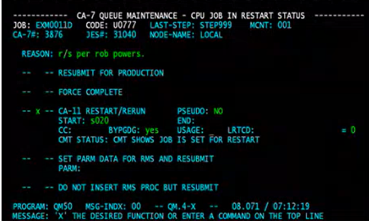
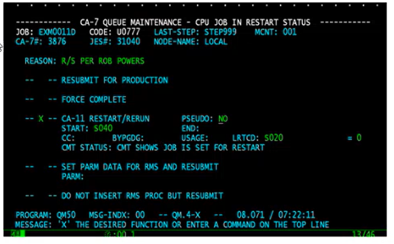

### JCL Recap
- We have jobs that are scheduled
- Jobs are submitted for batch execution
- Event-based vs time-based
    - Event-based, job will wait for a particular file
    - Time-based, a stream of jobs that will run in a particular time

## CA7
- CA7 is an online, real time, interactive system which automatically controls, schedules, and initiates work according to time-driven and/or event-driven activities.
    - Jobs
    - Scheduling
    - Requirement Definitions
- Batch Cycle - Sequencing of jobs to run order is called Batch Cycle
    - Successive jobs are initiated automatically when the previous jobs are completed and all requirements are satisfied
- The initiation of the job is done in 2 ways:
    - Time based - job runs based on the time specified in the Job
    - 
    - Event based - jobs are dependent on other jobs and run only when they are completed
    - 
- Sched Id: - a job can be a part of different batch cycles. To run the same job in different batch cycles, we use schid
    - Schids can be 1-255
    - Every job running in CA7 should have a Schid
    - Schid is very important when triggers are on
    - 
- Dead Line Time - the time by which the job shold meet the requirements and should start successfully
    - 
- Due Out Time - the time before which the job should complete successfully
    - 
- Elapsed Time - average of last five successful runs of the Job, it is calculated by CA7
    - 
- Submit Time - The time where the job should get submitted to the Operating System
- Lead Time/Look Back Time - the time where we can look back for the execution of the Job in the previous run where we can post the requirements if they are met
    - Lead Time varies from 0 to 99
    - 0 -> no lead time is to be considered when satisfying the job's requirements
    - 98 -> maximum lead time is 98 hours
    - 99-> Each predecessor job must complete normally while this job is in the request queue. this is a special case, even though it is equivalent to zero lead time. Because, the requirement is never to be considered as already satisfied when the job enters the queues
- Restart - the term restart is interpreted as restarting the job in the step in which it has failed
    - Different kinds of Restarts
        - Restarts with overrides
            - Handling overrides in CA7 is a common task during abend situations
            - For example, when the $IPJ100D job abended, the client called back for a JCL Override.
            - The JCL Override requested by the client was as follows:-
            - Change the file name on the ddname INTBR on STEP0080 to TEST.SEQ.FORMATED.COMTBE.DATA 
            - If the DD statements were listed in the CA7 JCL, then it would be a simple task of editing the JCL in CA7. The operator opened the JCL in edit mode and found that text STEP0080 for step name or text INTBR for ddname was not shown in the JCL text.
            - This means that the execution JCL in CA7 DOES NOT contain these statements and therefore must be located in the PROCLIB (procedure library).
            - Below is the Plain text which is displayed to the operator when an Edit of the JCL from CA7/11 is performed. 
            ```JCL
            //SIPJ100D JOB (T71489999),
            //   'OPS',
            //    MSGCLASS=J,
            //***    RESTART=JSXXXX.STEPXXXX,
            //    REGION=0K,
            //    CLASS=P
            //    JCLLIB ORDER=(PSNDVR.TBC.PROD.PROCLIB)
            //**********************************************
            //* FORMAT AND DISTRIBUTE TBE DATA
            //********************
            //JS0010 EXEC IPP100,
            //    SPACE2 4000,1500'
            ```
            - NOTE: A JCL RULE – ALL JCL STATEMENTS HAVE TO BE IN THE SAME SEQUENCE ORDER AT ALL TIMES. IF YOU EDIT IT, MAKE SURE JOBSTEPS AND PROCSTEPS ARE INSERTED IN SEQUENCE.
        - Restarts using BYPGDG parms
            - Job $51010D abends in step S020 with R4001. On call pgmr is contacted. They fix it and call back to edit JCL and restart
            - Change this statement below.
            ```
            //DSB51151 DD DSN=KFC.POS.SEQ.DSB51162.SCEDPOLL(+1),  <-____GDG
            //     DISP=SHR
            ```
            ```
            To this statement below
            //DSB51151 DD DSN=KFC.POS.SEQ.DSB51162.SCEDPOLL       <-_____EDIT
            //     DISP=SHR
            ```
            - Job is restarted in S020 using BYPGDG=YES
            - The reason for using BYPGDG is that CA11 (auto-restart) knows all the datasets used for each job and gathers all this information in the RMS step (1st step of every job). CA11 knows that when the job abended that the original dataset was a GDG file(+1) and you have changed the dataset. The only way to get around this so CA11 can accept the change is to use BYPGDG=YES
            - 
        - Restart from a step other than the abend step
            - In this sample, job abended in step S020 but is being restarted in step S040. Notice the abended step is INSERTED in field LRTCD. This fools CA11RMS into thinking S020 completed successfully with a return code of zero(0).
            - 
## CICS
- ASKTIME
    - used to obtain current date and time
    - Syntax:
        - EXEC CICS ASKTIME[ABSTIME(data-area)]
        - END-EXEC
- FORMATTIME
    - EXEC CICS FORMATTIME ABSTIME(data-ref)
        - [YYDDD(data-area)]
        - [YYMMDD(data-area)], ..etc.
    - END-EXEC
- DELAY
    - Used to delay the processing of a task
    - Syntax:
        - EXEC CICS DELAY
            INTERVAL(hhmmss) | TIME(hhmmss)
        - END-EXEC
- START
    - EXEC CICS START
        - TRANSID(transid)
        - [TERMID(termid)
        - TIME(hhmmss) | INTERVAL(hmmss) ]
    - END-EXEC
    - Conditions: INVREQ, LENGERR, TERMIDERR, TRANSIDERR
- Other Interval Control Commands
    - POST - request noficiation when the specified time has expired
    - WAIT EVENT - wait for an event to occur
    - RETRIEVE - retrieve data passed by START
    - CANCEL - cancel the interval control requests
    - SUSPEND - suspend a task
    - ENQ - gain exclusive control over a resource
    - DNQ - free the exclusive control from the resource gained by ENQ
### Terminal Conversation
- Conversational
    - A dialogue between program and terminal based on sending/receiving messages within the same task
- Pseudo-Conversational
    - dialogue between program and terminal which appears as a continuous conversation but is actually carried by a series of tasks
### Queues
- https://www.tutorialspoint.com/cics/cics_temporary_storage.htm#:~:text=Temporary%20Storage%20Queue%20(TSQ)%20is,is%20used%20to%20identify%20TSQ.
#### Transient Data Queue
- TDQ                      : TD and last 2 char of your userid EX: TD01
- Data can be stored/queue for subsequent internal/external processing
- Stored data can be routed to symbolic destinations
- TDQs require a DCT entry
- Intra-partitioned
    - association within the same CICS subsystem
- Extra-partitioned
    - association external to the CICS subsystem
- Operations
    - Write data to a transient data queue
    - Read data
    - Delete queue, deletes all entries in the queue
- Destination Control Table
    - DCT used to register the information of all TDQs
    - Destination Control Program (DCP) uses DCT to identify all TDQs and perform all I/O operations
#### Temporary Storage Queue
- created and deleted dynamically
- No CICS table entry required if recovery not required
- Each record in TSQ identified by relative position, called the item number