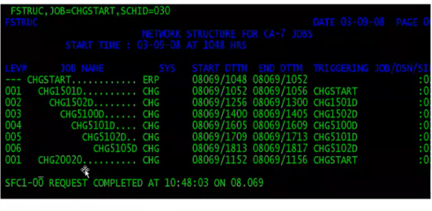
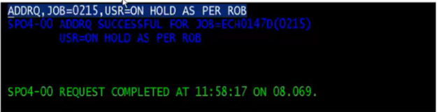
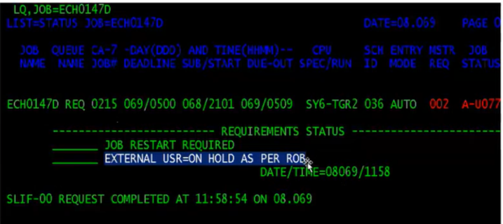
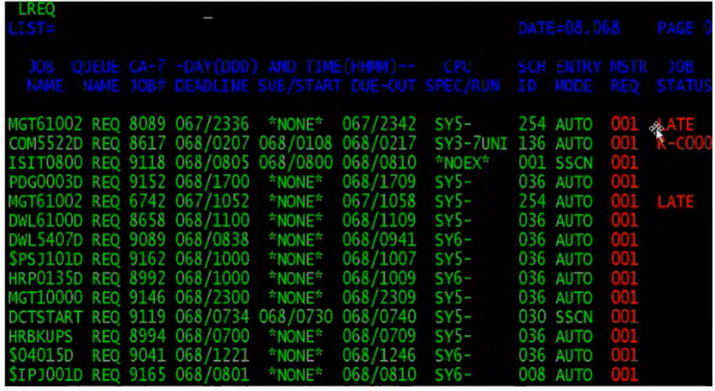
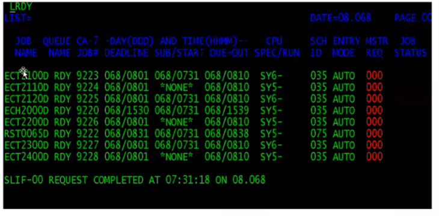

## CA7
- Force Complete vs Cancel?
    - FORCE COMPLETE is marked within CA-7 as a normal completion. Jobs waiting for the successful completion of this job will now run - if all other requirements of the job are satisfied.
    - CANCEL - a failed job is removed from the CA-7 queue. Jobs waiting for the successful completion of this job will not run unless the requirement for the failed job is manually satisfied and of all other requirements of the job are satisfied
    - RESTART - restart the job in the step which has failed
    - RE-RUN - re-running the job from the first step, same meaning as RESUBMIT
- Job Trigger:
    - 
- SCHID - a schedule or job stream can have many different variations. Each variation is called a schid or schedule id. For example, Job1 may trigger Job 2 on schid 1, but on schid 3 Job 1 may trigger Job 3.
- HOLD - A job can be placed on hold before or after it enters the CA-7 queue. The job will remain in hold, meaning it will not run, until the hold is removed
- What happens if we cancel the job in the middle?
- Hold on job can be put when the job is in the queue and when the job is not in the CA7 queue.
- When the job is in CA7 Queue Add a user requirement to the job
- ADDRQ - add a new request
- 
- As we see, the job is placed on hold:
    - 
- Three main queues in CA-7
    - Request Queue - LREQ
        - Three ways to remove jobs from Request Queue
            - Restart
            - Cancel - remove jobs from ca7 request queue
                - syntax: Cancel, job=ca7-id=text,force=yes
                - Note: cancellation of the jobs in the Ready Queue or active queue does not cause termination of the jobs' execution
                - Using cancel command not only removes the job from request queue but also it it doesn't trigger the other jobs
            - Force Complete - mark the status of the jobs as complete and also triggers the successor jobs
        
        - 
    - Ready Queue - LRDY
        - Once the job meets the requirements, the job moves from the request queue to the Ready Queue
        - Normaly, jobs will not wait in the Ready Queue for a long time
        - Different Scenarios where jobs eld up in the Ready Queue are:
            - Contention
            - Initiators are not free
            - Jobs with incorrect syntax
        - When the job is in the Ready Queue, CA-7 will not release the job from the Ready Queue until it gets all the resources.
        - If the job is hung up in the Ready Queue for a long time, we will move it to the Request Queue
            - We use the Requeue command to do so
            - Requeue job=(job name/job no), Q=(rdy)
            - Note: Don't use the Requeue Command when the job is submitted to spool, as it creates one more instance of the job in the Request Queue
        - 
    - Active Queue - LACT
        - Once the jobs meet all the requirements and gets all its required resources, jobs will move to the Active Queue
        - Once the jobs are in the Active Queue, CA-7 doesn't have control on the jobs and to analyze the jobs in the active queue we need to go to spool
        - OS controls the job once it starts on the system. CA-7 captures job status coming from the system
- Job Status Late - it is waiting for some other requirement to finish
- Dead Line Time - it is the time by which the Job should meet the requirements and should start successfully

## Handling DB2 with CICS
- Remember, we have DCLGEN (declaration generator) - generate variables based on table in SQL, bring it over to a member where it can be access by COBOL code
    - Create table layout
    - COBOL only has 3 data types while SQL has about 15
    - DCLGEN is a built-in tool that takes table as input and converts the table name and column names into COBOL adaptable variables
        - These variables can be used in our program
    - Host Variables - prefixed with HV, these are the COBOL-adaptable variables that are generated via DCLGEN
    - If I'm handling files, need File Layout
    - When value comes up from a map, what is the map layout we have?
- Dynamic Positioning - 
- Can move a -1 to the length variable and then send a map
