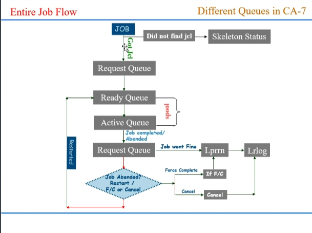

## CA7
- ADDRQ,JOB=JOBNAME,USR=AS PER REQUESTOR  
- *None* - no start time, due to it being a structured job, event-based, not time-based
- 
### Request Queue
- Once the job is triggered by the predecessor job, it first comes into the request queue and waits until it meets all the requirements
- When job comes into the request queue with a unique ca7-id and it is same until is it successfully completed or thrown out of all the Queues
- The jobs which are abended also comes into the request Queue with abended status
- There are 3 ways by which the jobs come into the Request Queue
1. Sscan (scheduled scan): The job is scheduled to run at a specific time
2. Auto - The job is event driven
3. Demand: When the operator runs the job using the demand command
#### Demand Command
- Used to force immediately scheduling of a job 
- Syntax: demanddb,job=job name,schid=schid,set=ntr,
    - Demand a job with no triggers
- To demand a job which needs to be restarted from a particular step
- Syntax; Demand.job=job name, schid=schid,type=res
- Note: 
    - Always cross check the SCHID and trigger option before demanding the job
    - Default schid is --1 with triggers
    - It is always safe to demand a job with hold.
#### Cancel
- Cancel - this command is used to remove the jobs from CA7 request Queue
    - Syntax: Cancel.job=ca7-id,Reason=text,force=yes
    - Note Cancellation of the jobs in the Ready Queue or active queue does not cause termination of the jobs execution
    - Using comand not only removes the job from request queue but also it doesn't trigger the other jobs

#### Force Complete
- Will not only mark the status of the jobs in the request queue but also triggers the successor jobs

### Ready Queue
- Once the job meets the requirements, the jobs moves from the request queue to Ready Queue
- Normally jobs will not wait in the ready Queue for a long time
- Different scenarios where jobs held up in the Ready Queue are:
    - Contention
    - Initiators are not free
    - Jobs with incorrect syntax
- When the job is in the ready queue, CA-7 will not release the job to Spool until it gets all the resources.
- If the job is hung up in ready queue for a long time, we will move the job from the ready queue to the Request Queue
- We use Requeue command to move jobs from ready queue to Request queue
    - Requeue,job=(job name/job no.),Q=(rdy)
- Note, Don't use Requeue Command when the job is submitted to spool, as it creates one more instance of the job in the Request Queue

### Active Queue
- Once the job meets all the requirements and gets all the resources it requires, jobs will move to the Active Queue
- Once the jobs are in the active queue, CA-7 doesn't have control on the jobs and to analyze the jobs in the active queue
- LQ.ST=SKEL

### Job Flow:
- 

### Commands:
- DEMAND
- DEMANDH
- CANCEL
- HOLD
- RELEASE